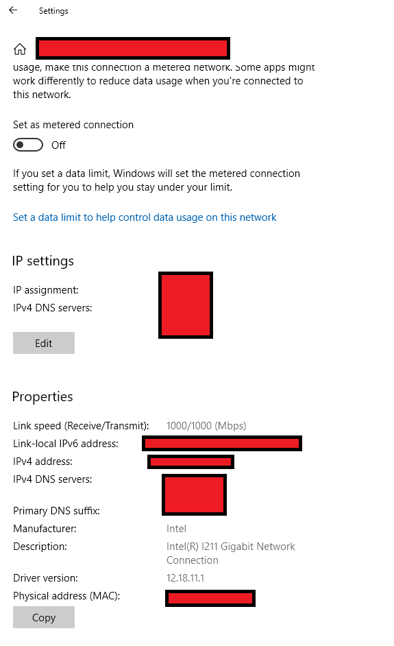
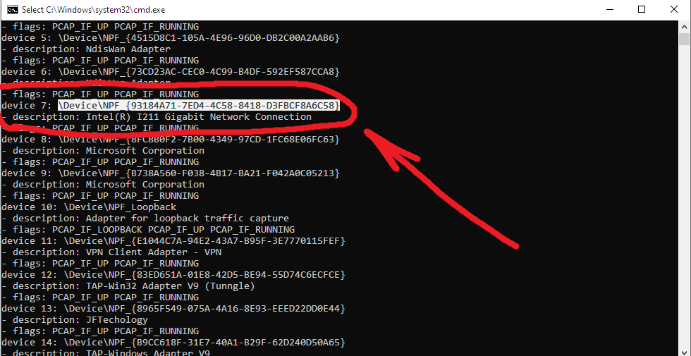
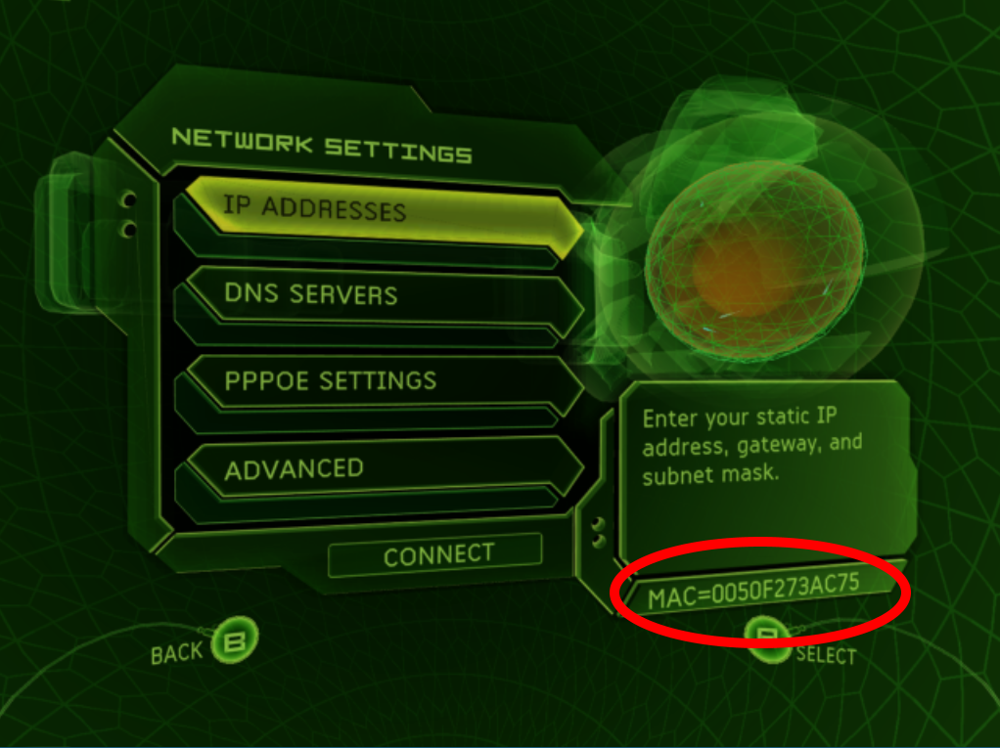

# Xemu to Xbox System Link Tutorial

[Download](https://github.com/WIFIDarthMaul/Xemu-to-Xbox-System-Link-Tutorial/raw/main/Xemu%20to%20Xbox%20Sys%20Link%20Guide%20(with%20l2tunnel).zip)

How to play system link with an OG Xbox using Xemu:
(Windows 10 tutorial)

1.	In the Windows search bar type: Network status and open it.
2.	When it opens, click on Properties in the middle, and you should see your Network Description towards the bottom. (Mine is Intel(R) I211 Gigabit Network)

3.	Now open “start cmd.bat” that is included in the folder with l2tunnel.exe, and type: l2tunnel.exe list
4.	Scroll down till you see your Network Description, above it copy your Device number, mine is “\Device\NPF_{93184A71-7ED4-4C58-8418-D3FBCF8A6C58}”

 
5.	Then turn on your OG Xbox, go to the Xbox Dashboard, then open Settings, then Network Settings, and copy your MAC address as seen here:

6.	Separate your MAC address with colons (Example: 00:50:f2:73:ac:75)
7.	Now in cmd, type: l2tunnel.exe tunnel YOURNETWORKDESCRIPTIONHERE -s YOURMACHERE 0.0.0.0 1337 127.0.0.1 1338 (Ex: l2tunnel.exe tunnel \Device\NPF_{93184A71-7ED4-4C58-8418-D3FBCF8A6C58} -s 00:50:f2:73:ac:75 0.0.0.0 1337 127.0.0.1 1338)
OPTIONAL:
	You can create a shortcut .bat file to automatically start system link by opening Notepad and typing: start cmd /k l2tunnel.exe tunnel YOURNETWORKDESCRIPTIONHERE -s YOURMACHERE 0.0.0.0 1337 127.0.0.1 1338 and saving it as a batch file in the same folder as l2tunnel.exe
8.	In Xemu, open Network, then change from NAT to Socket, and set the Remote Host to 127.0.0.1:1337 and the Local Host to 0.0.0.0:1338 and click Enable.
9.	Now open the game of your choice and choose System Link. You should now be able to play sys link with an OG Xbox and Xemu.

NOTE:
If there are updates, or dlc that the Xbox has and Xemu doesn’t, or vice versa, it won’t work. Each has to be on the same version and have the same dlc. Either download, or delete them to fix it.
